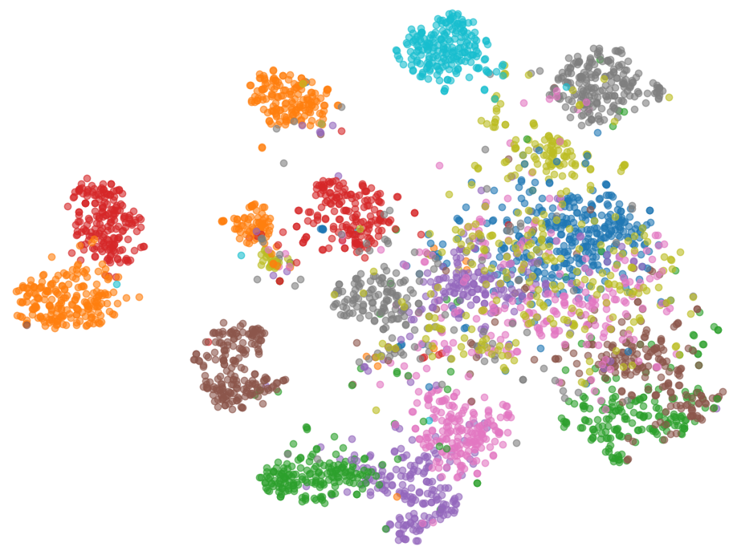
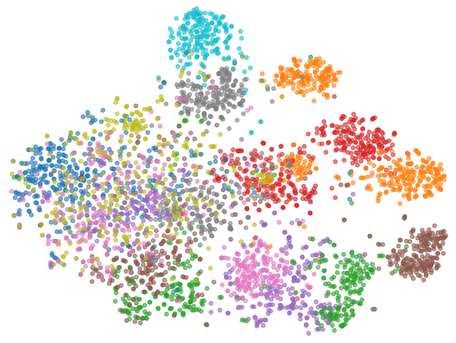

### This is the official code repository for the paper:
## SemCSE: Semantic Contrastive Sentence Embeddings Using LLM-Generated Summaries For Scientific Abstracts

To train your own SemCSE model and directly evaluate it on our newly created semantic benchmark, simply run `main.py`. The few lines of code contained in it should be largely self-explanatory.

### Repository Structure

- `data` contains the dataset of 350,000 scientific abstracts with corresponding LLM-generated summaries.
- `generate_search_queries.py` and `generate_train_summaries.py` are used to generate the queries used within the query-matching benchmark task and the summaries used for training, respectively.
- `load_data.py` is used to load the summaries during training.
- `semantic_benchmark.py` contains code for evaluating models on our proposed semantic benchmark.
- `settings.py` contains global hyperparameter. Here, you can set whether you want to train the model using Euclidean distance or cosine similarity.
- `train_embedding_model.py` contains the code for training the SemCSE model.

For evaluations on the SciRepEval benchmark, please use the [code from the original study](https://github.com/allenai/scirepeval).

### The Novel Semantic Embedding Benchmark

We propose a new benchmark for evaluating the capabilities of embedding models to encode the precise underlying semantics.
The benchmark contains four tasks:
- *Title–Abstract Matching*: Match paper titles to their corresponding abstracts. A good semantic model should produce similar embeddings for both.
- *Abstract Segmentation Consistency*: Match two halves of the same abstract. Both parts represent the same core content, and strong semantic embeddings should reflect that.
- *Query Matching*: Match a paper to a search query generated from it using a large language model (Mistral 3.1 small).
- *Semantic Clustering*: Given papers with thematic labels (from SciDocs MAG), retrieve nearest neighbors and measure how well the embedding space groups semantically similar papers.

### 📊 Semantic Benchmark Results

| **Model**               | Params | Title-Abstract ↓ | Abstract-Segments ↓ | Query ↓ | Clustering ↑ | Perf. ↑ |
|-------------------------|--------|------------------|----------------------|---------|---------------|----------|
| SciBERT                 | 109M   | 807.74           | 214.37               | 213.45  | 0.569         | 0.000    |
| SciDeBERTa              | 183M   | 1479.09          | 861.55               | 2465.26 | 0.460         | 0.000    |
| SPECTER                | 109M   | 10.25            | 12.23                | 2.18    | 0.692         | 0.119    |
| SciNCL                  | 109M   | 5.68             | 7.35                 | 2.29    | 0.702         | 0.357    |
| SPECTER2 (base)         | 109M   | 4.52             | 5.10                 | 1.17    | 0.666         | 0.553    |
| SPECTER2 (proximity)    | 110M   | 5.34             | 5.80                 | 1.46    | 0.666         | 0.395    |
| all-MiniLM-L6-v2        | 22M    | *3.09*           | 8.19                 | 1.11    | *0.730*       | 0.771    |
| Jina-v2                 | 137M   | 3.29             | 8.77                 | 1.29    | 0.703         | 0.600    |
| Jina-v3                 | 572M   | 3.45             | 6.96                 | **1.01**| 0.719         | 0.783    |
| RoBERTa SimCSE          | 355M   | 23.71            | 44.24                | 8.92    | 0.696         | 0.116    |
| NvEmbed-V2              | 7.9B   | 3.38             | *3.84*               | *1.02*  | 0.721         | *0.866*  |
| **SemCSE (Ours)**       | 183M   | **2.47**         | **2.68**             | 1.23    | **0.739**     | **0.925**|

**Notes:**

- **Bold** = Best result  
- *Italic* = Second-best result  
- ↓ = Lower is better (ranking-based tasks)  
- ↑ = Higher is better (clustering and overall performance)

### The SemCSE model

We introduce SemCSE, a novel unsupervised training scheme for creating high-quality semantic embeddings for scientific texts by focusing purely on their content, rather than relying on noisy citation-based signals. It is trained using a contrastive objective where the model learns to identify that different summaries of the same abstract, generated by an LLM, share a common underlying meaning. This approach forces the model to learn a robust and semantically-focused representation, leading to state-of-the-art performance on tasks requiring deep semantic understanding. This is also highlighted by the stronger semantic separation achieved by SemCSE when clustering scientific abstracts on the SciDocs MAG dataset:

|  |  |
|:---:|:---:|
| SemCSE | SPECTER |

SemCSE achieves state-of-the-art results on our Semantic Embedding Benchmark, as well as on the SciRepEval benchmark when comparing against models of its size:

### 📊 SciRepEval Benchmark Results

| **Model** | **Parameters** | **Classification ↑** | **Regression ↑** | **Proximity ↑** | **Search ↑** | **Average ↑** |
| :--- | :--- | :--- | :--- | :--- | :--- | :--- |
| SciBERT | 109M | 63.86 | 27.34 | 66.25 | 68.19 | 57.42 |
| SciDeBERTa | 183M | 60.99 | 27.00 | 62.74 | 67.83 | 55.18 |
| SPECTER | 109M | 67.73 | 25.37 | 80.05 | 74.89 | 64.28 |
| SciNCL | 109M | *68.04* | 25.22 | *81.18* | 77.32 | 65.08 |
| SPECTER2 base | 109M | 66.95 | *27.75* | 81.10 | 78.42 | 65.46 |
| SPECTER2 proximity | 110M | 66.37 | 26.85 | **81.41** | 77.75 | 65.15 |
| all-MiniLM-L6-v2 | 22M | 64.04 | 20.06 | 80.74 | 79.63 | 63.05 |
| jina-v2 | 137M | 63.99 | 23.76 | 80.11 | 80.40 | 63.69 |
| jina-v3 | 572M | 65.66 | 24.84 | 79.98 | *80.60* | 64.34 |
| RoBERTa SimCSE | 355M | 67.16 | 22.95 | 75.51 | 76.97 | 62.10 |
| NvEmbed-V2 | 7.9B | 65.62 | **29.94** | 81.16 | **82.84** | **66.19** |
| **SemCSE (Ours)** | 183M | **69.52** | 27.58 | 80.21 | 78.56 | *65.76* |

**Notes:**

- **Bold** = Best result
- *Italic* = Second-best result
- ↑ = Higher is better

### Citation

Will be added shortly.
